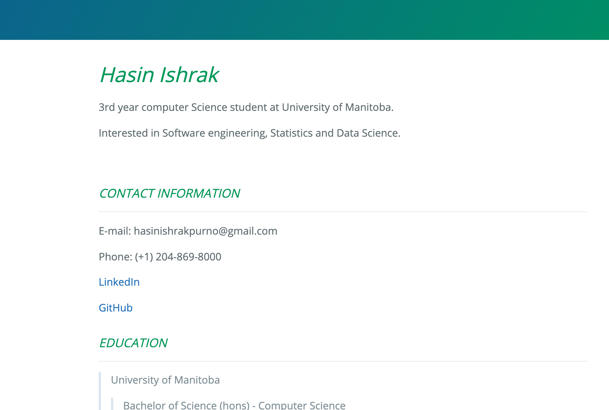

# Hosting a markdown formatted resume on GitHub

### *Purpose*

---

We will get to know about the practical steps of how to host and format a resume using Markdown, a Markdown editor, GitHub pages and Jekyll. Also we will hopefully get an idea about key principals in technical communication, as explained in Andrew Etter's book *Modern Technical Writing*.

### *Prerequisites*

---

In order to know about the practical steps of how to host a markdown formatted resume on GitHub, it is essential to have a well-formatted and up-to-date resume. Then we will use [Markdown](https://en.wikipedia.org/wiki/Markdown), a lightweight markup language, to build a markdown formatted resume. If you do not know anything about Markdown yet or want to know more about Markdown, I have attached two good Markdown tutorial links under "More Resources" section. At this stage, you should have a markdown formatted resume ready.

### *Instructions*

---

1. **Use Lightweight Markup** **Language**

   > Using a lightweight markup is one of the key principals in technical communication now-a-days. There are reasons behind this. As discussed in the Etter's book, contribution is one of the main beliefs in technical writing.  If our content is stored in XML-based languages, people's ability to contribute gets reduced. There are some specialized editors however, these cost a lot of money. For documentation, lightweight markup is free and superior in every meaningful way. There are many lightweight markups. We are using [Markdown](https://daringfireball.net/projects/markdown/) to format out resume.
   >
   > Markdown is the most widely used lightweight markup language in the world. Also, it has the cleanest syntax. Markdown allows you to write using a easy-to-read, easy-to-write plain text format, then convert it to structurally valid XHTML. There are many specialized text editors for this popular lightweight markup language. [Typora](https://typora.io/), [Markdown Pad](http://markdownpad.com/) are the most popular ones. There are some online editors available which are also helpful. We can use any of these editors to make our resume markdown formatted. Please visit the "more resources" section for more details.
   >
   > At this point, we should have a resume ready where we used a lightweight markup language called Markdown. Next we will learn about where to host and how to host the markdown formatted resume.

   

2. **Use Distributed Version Control**

   > According to Etter's book, "All sorts of people have extolled the virtues of distributed version control systems (DVCS) like [Git](https://git-scm.com/) / [GitHub](https://github.com) over centralized systems." The basic benefits of DVCS are:
   >
   > * DVCS have better performance
   > * DVCS allow for offline work
   > * DVCS are superior for concurrent work
   >
   > Whenever we store our documentation, we should always place a file named README.md in the root of the repository. This file should contain
   >
   > 1. A quick summary of the product being documented
   > 2. Instruction on how to build the documentation locally
   > 3. Instruction on how to contribute
   >
   > For this project, we will use GitHub to host our markdown formatted resume. In order to do so, one  must have an account on GitHub. So, the fist step is to go to [GitHub](https://github.com) and create an account.
   >
   > If you already have an existing GitHub account, you just need to Sign in to our account. Then we should follow the following instructions:
   >
   > 1. Create a new repository
   >
   >    > * Click on the `new` green button on the repository section
   >    > * Give a name to the newly created repository
   >    > * You can add some description if you want
   >    > * Make the repository public 
   >    > * Click on the `create repository` button on the bottom left corner
   >
   > 2. Add files to the repository
   >
   >    > * Go to the newly created resume
   >    > * Click on the `add file` button 
   >    > * Choose `create new file` 
   >    > * Give the file name index.md
   >    > * Click on the `commit new file` button
   >
   > 3. Add another file named "README.md" using the same steps shown on 2.
   >
   > 4. Upload our resume
   >
   >    > * Go to the newly created resume
   >    > * Click on the file named index.md
   >    > * Click on the "edit" button ( in the top right corner, beside the `row/blame` button)
   >    > * Write the markdown formatted resume on the editor
   >    > * Click on the `Commit Changes` button on the bottom left corner
   >
   >    Now, our markdown formatted resume should be visible on GitHub whenever we go to index.md file of the newly created repository.

   

3. **Use static websites**

   > The author of the book _Modern Technical Writing_ said he loves the speed, simplicity, portability and security of the static websites. One can host static websites practically anywhere, including Amazon S3 and GitHub pages. We will use GitHub pages to host the static site for our resume. One can manually create a simple static website. But the easy option is to use a generator. You just need a content (lightweight markup) and a theme, and it processes everything into a working website.
   >
   > GitHub pages use JeKyll static site generators. At this point we do not need to know much about JeKyll. If you are interested to know more about JeKyll please visit the "more resources" section.
   >
   > To make a static website we need to follow the following steps:
   >
   > 1. Go to settings of newly created repository
   > 2. Scroll down to GitHub pages section
   > 3. Choose ` master` from the drop down menu
   > 4. Click on `save` button
   > 5. Click on `Choose Theme` button
   > 6. Select any of the suitable themes
   >
   > After a while, when the site will be ready to publish there will be a green correct sign on the left side of the GitHub pages section and a link to the website will be provided. Click on the link to see the static website.

   

   

   ##### More Resources

   * Resources on Markdown:
     * [Markdown Guide](https://www.markdownguide.org/extended-syntax/#strikethrough) is a wonderful resource to have while learning Markdown.
     * [Markdown Tutorial](https://www.markdowntutorial.com) is a good place to start learning about Markdown.

   * A link to Etter's book :[ _Modern Technical Writing_ ](https://www.amazon.ca/Modern-Technical-Writing-Introduction-Documentation-ebook/dp/B01A2QL9SS/ref=sr_1_1?crid=331C6HXMEK2GK&dchild=1&keywords=modern+technical+writing+by+andrew+etter&qid=1604455886&sprefix=modern+tech%2Caps%2C213&sr=8-1)

   * Resources on JeKyll:
     * A [video series](https://www.youtube.com/playlist?list=PLLAZ4kZ9dFpOPV5C5Ay0pHaa0RJFhcmcB) tutorial on JeKyll

   

   ### Authors and Acknowledgement

   ---

   This README.md was written by Hasin Ishrak.

   A great level of inspiration was taken from Andrew Etter's book _Modern Technical Writing_.

   I have to thank my group members of COMP3040 class. They helped me to understand the things needed for this writing to be completed.

   ### FAQs

   ---

   Q: Why is Markdown better than a word process?

   > The good word processors are costly. Which make them beyond the reach of most of the people. As a result, people fail to contribute. On the other hand, Markdown is free and easily accessible for most of the people. which gives people inspiration to contribute.

   Q:Why does my resume not showing up?

   > Sometimes it takes time to show our resume on a static site especially after changing themes. Check back after five minutes if it is showing up. If the resume is not showing up after the wait, make sure that you have completed all the steps shown on Using Static Website section.
